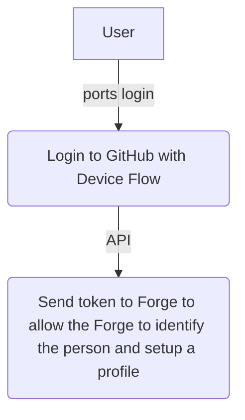

## Assumptions
The assumptions this workflow was built under are as follows:
- Users do not use this Platform as source code hosting
- We will use other independant source code hosting
- Authentifying against other services becomes more important than having a forge Identity. 
- Aurora OpenCloud may be added in the future but not as main dependency.
## Desicions
- Since most people have a GitHub account we will use that as source of Logins

## Login

## API Functions
### register
Use a GitHub Token to create a forge identity and a home publisher plus profile entries for a user